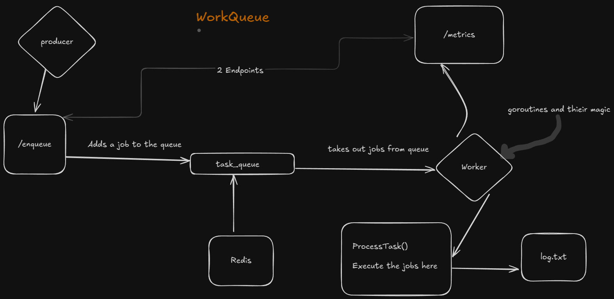

# WorkQueue

A Distributed Background Task Processing System — originally written in Go, now also available as a **Python implementation** using FastAPI and Upstash Redis (no Docker required).

**High level overview**


---

## What's the need for this?

This system is designed to handle the processing and execution of background tasks concurrently to improve user experience.

**Example:** When a user signs in to your website and clicks the login button, you might want to send them a welcome email. If that email task is part of the API call, the user would have to wait until the email is sent. Instead, you can add the `send_email` task to WorkQueue and let it handle the execution in the background.

**Note:** This is modular — any type of job can be added. Just register a new handler function in `processor.py`.

---

## Services

This repo provides two independent services:

### 1. Producer
Provides a `/enqueue` route to add your jobs/tasks.

### 2. Worker
- Takes the jobs from the queue in a reliable manner and executes them concurrently
- Provides a `/metrics` endpoint to view statistics

---

## Python Implementation (`/python`)

### Tech Stack
| Technology | Purpose |
|------------|---------|
| **FastAPI** | REST API for producer & metrics |
| **Redis / Upstash** | Cloud-hosted queue — no Docker needed |
| **ThreadPoolExecutor** | 3 concurrent worker threads |
| **Pydantic** | Automatic request validation |
| **python-dotenv** | `.env` config loading |
| **uvicorn** | ASGI server |

### How to Run

```bash
# 1. Activate venv (from WorkQueue-main root)
venv\Scripts\activate

# 2. Install dependencies
cd python
pip install -r requirements.txt

# Terminal 1 — Producer
uvicorn producer:app --port 8080 --reload

# Terminal 2 — Worker
python worker.py
```

---

## Testing with Postman

Make sure both Producer and Worker are running first.

### Request 1 — Health Check
| Field | Value |
|-------|-------|
| **Method** | `GET` |
| **URL** | `http://localhost:8080/health` |

**Expected Response:**
```json
{ "status": "ok" }
```

---

### Request 2 — Enqueue a `send_email` Task ✉
| Field | Value |
|-------|-------|
| **Method** | `POST` |
| **URL** | `http://localhost:8080/enqueue` |
| **Body** | `raw` → `JSON` |

**Body to paste in Postman:**
```json
{
    "type": "send_email",
    "payload": {
        "to": "user@example.com",
        "subject": "Hello from WorkQueue!"
    },
    "retries": 2
}
```

**Expected Response:**
```json
{
    "message": "Task 'send_email' added to queue",
    "queue_length": 1
}
```

---

### Request 3 — Enqueue a `resize_image` Task 🖼
```json
{
    "type": "resize_image",
    "payload": {
        "url": "https://example.com/photo.jpg",
        "width": 800
    },
    "retries": 1
}
```

---

### Request 4 — Enqueue a `process_data` Task ⚙
```json
{
    "type": "process_data",
    "payload": {
        "item_id": 42,
        "value": 420
    },
    "retries": 0
}
```

---

### Request 5 — Check Worker Metrics 📊
| Field | Value |
|-------|-------|
| **Method** | `GET` |
| **URL** | `http://localhost:8081/metrics` |

**Expected Response:**
```json
{
    "total_jobs_in_queue": 0,
    "jobs_done": 3,
    "jobs_failed": 0
}
```

---

### Request 6 — Trigger Validation Error (Missing Fields)
```json
{
    "type": "send_email",
    "payload": {}
}
```
**Expected:** `400 Bad Request` — proves the Producer validates before queuing.

---

### Postman Step-by-Step
1. Open Postman → click **New** → **HTTP Request**
2. Set method to `POST` and URL to `http://localhost:8080/enqueue`
3. Click **Body** tab → select **raw** → set dropdown to **JSON**
4. Paste any JSON from above → click **Send**
5. Watch your **Worker terminal** — you'll see the task being processed in real time!

---

## Running the Automated Test Suite

```bash
python test_workqueue.py
```

| Test | What it checks |
|------|---------------|
| ✔ Test 1 | Producer health check |
| ✔ Test 2 | Valid `send_email` task accepted |
| ✔ Test 3 | Generic task (`resize_image`) accepted |
| ✔ Test 4 | Bad `send_email` payload → 400 rejected |
| ✔ Test 5 | Empty task type → 422 rejected |
| ✔ Test 6 | Worker metrics show processed jobs |
| ✔ Test 7 | Burst of 10 tasks — all enqueued successfully |

All 7 tests pass ✅

---

## Additional Features

- **Concurrency** — 3 worker threads process tasks in parallel using `ThreadPoolExecutor`
- **Retry logic** — failed tasks are automatically re-queued with a decremented retry counter
- **Structured logging** — every success/failure written to `logs.txt` and console
- **Decorator registry** — add a new task type in one function, zero other changes needed
- **Cloud Redis** — powered by [Upstash](https://upstash.com), no Docker required

---

## 🚀 Deploy to Render (Free)

This project includes a `render.yaml` file for one-click deployment.

### Step 1 — Push to GitHub
Make sure your repo is on GitHub. The `.gitignore` already excludes `.env` so your secrets are safe.

### Step 2 — Connect to Render
1. Go to [render.com](https://render.com) → **New** → **Blueprint**
2. Connect your GitHub repo
3. Render will auto-detect `render.yaml` and set up **both services** for you:
   - `workqueue-producer` — Web Service (gets a public URL)
   - `workqueue-worker` — Background Worker (runs silently in the background)

### Step 3 — Set Environment Variable
For **each service**, go to **Environment** tab and add:

| Key | Value |
|-----|-------|
| `REDIS_URL` | `rediss://:YOUR_TOKEN@trusting-airedale-14783.upstash.io:6379` |

> ⚠️ Never paste your `.env` file to GitHub. Always set secrets in the Render dashboard.

### Step 4 — Deploy
Click **Apply** — Render will build and start both services.

### Step 5 — Test Live
Once deployed, your producer gets a public URL like:
```
https://workqueue-producer.onrender.com
```

Test it with Postman or curl:
```bash
curl -X POST https://workqueue-producer.onrender.com/enqueue \
  -H "Content-Type: application/json" \
  -d '{"type": "send_email", "payload": {"to": "user@example.com", "subject": "Live!"}, "retries": 2}'
```

---

Created by - Apoorv Tiwari